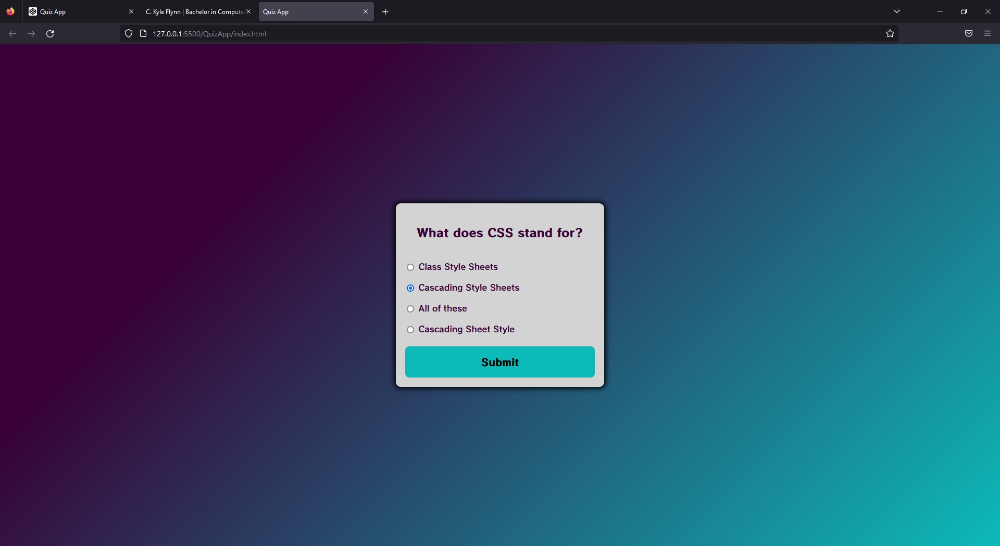
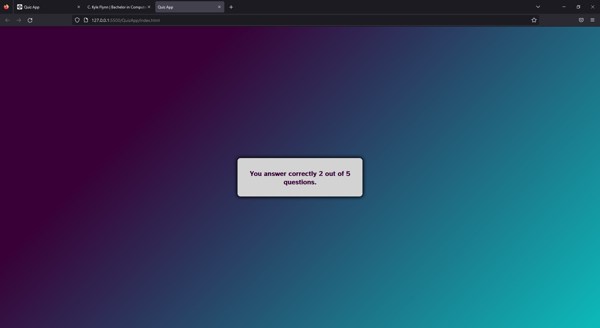
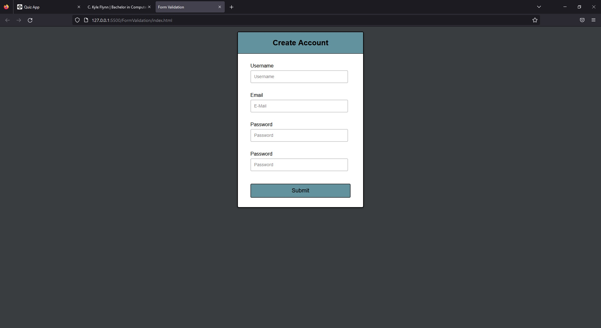
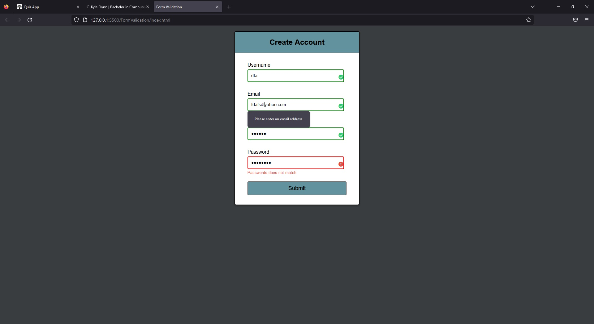
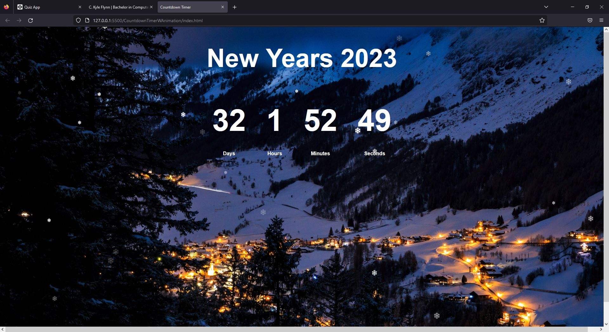

[Back to Portfolio](./)

JavaScript W Codepen.io
===============

## Project I
Coding Quiz
### Description
Quiz topics include JavaScript, CSS, and HTML. Object quizData with questions, answers, correct answers. Totals the correct answers for user

-   **Language(s): JavaScript, CSS, HTML**
-   **Source Code Repository:** [Github Link](https://github.com/ckyleflynn/JS_code-project1-/tree/main/QuizApp)
-   **Codepen:** [Codepen.io](https://codepen.io/Ckflynndev/pen/gOWvdOy?editors=0100)
   

Fig 1. Multiple Questions in Obj

Fig 2. Returns total correct answers

## Project II
Form Validation
### Description
A user "create account" that verifies user inputs are correct. Using regular expressions

-   **Language(s):** JavaScript, CSS, HTML
-   **Source Code Repository:** [GitHub Link](https://github.com/ckyleflynn/JS_code-project1-/tree/main/FormValidation)
-   **Codepen:** [Codepen.io](https://codepen.io/Ckflynndev/pen/WNjMgpw)

Fig 3. Unfilled out account

Fig 4. Makes sure passwords match and email is valid

## Project III
New Years Countdown
### Description
A countdown timer until 2023. Animated falling snowflakes

-   **Language(s):** JavaScript, CSS, HTML
-   **Source Code Repository:** [Github Link](https://github.com/ckyleflynn/JS_code-project1-/tree/main/Countdown%20Timer%20w%20Animation)
-   **Codepen:** [Codepen.io](https://codepen.io/Ckflynndev/pen/vYmdzEQ)

Fig 5. Fun falling snow math

[Back to Portfolio](./)
