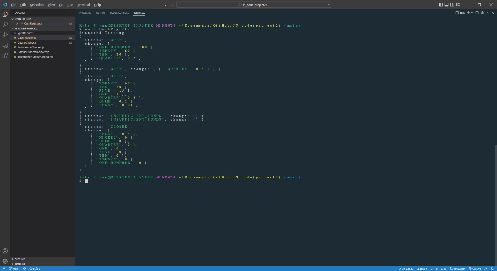

[Back to Portfolio](./)

JavaScript
===============

## Project I
Cash Register
### Description
An array of objects manipulation with console log testing. Will return change or Insufficient Funds

-   **Source Code Repository:** [Github Link](https://github.com/ckyleflynn/JS_code-project2-/blob/main/CashRegister.js)  

## Project II
Caesar Cipher
### Description
The Caesar Cipher function with console log testing

-   **Source Code Repository:** [Github Link](https://github.com/ckyleflynn/JS_code-project2-/blob/main/CeasarCipher.js)  

## Project III
Palindrome Checker
### Description
Fun JS built in functions

-   **Source Code Repository:** [Github Link](https://github.com/ckyleflynn/JS_code-project2-/blob/main/PalindromeChecker.js)  

## Project IV
Roman Numeral Converter
### Description
For loop containing a while statement

-   **Source Code Repository:** [Github Link](https://github.com/ckyleflynn/JS_code-project2-/blob/main/RomanNumeralConvert.js)  

## Project V
Telephone Number Checker
### Description
A function that uses a regular expression to verify correct phone number is inputted

-   **Source Code Repository:** [Github Link](https://github.com/ckyleflynn/JS_code-project2-/blob/main/TelephoneNumberChecker.js)  

[Back to Portfolio](./)
