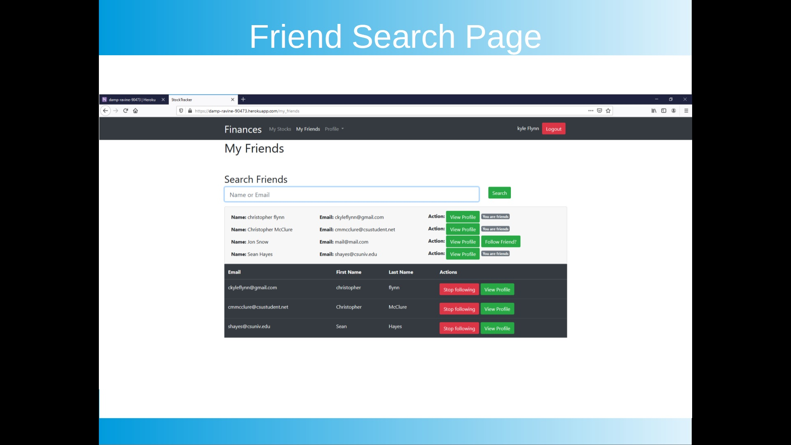
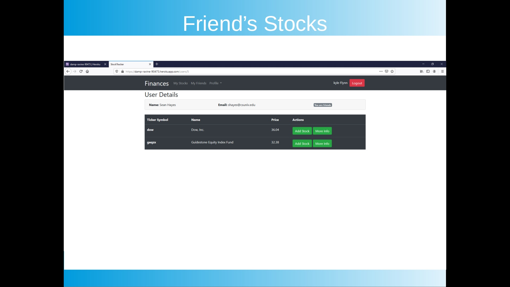
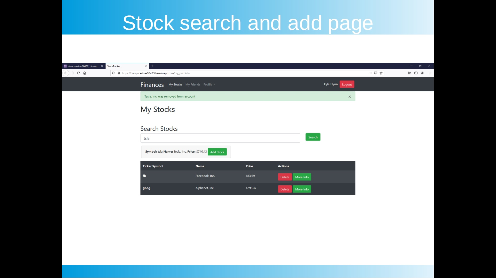

[Back to Portfolio](./)

# Stock Market Website
===============

-   **Language(s):** Ruby 2.6.6, Rails 6.0.2.2, Heroku, Devise, Bash, JS, HTML, CSS, Bootstrap, IEX Finance API, More included in the Gemfile
-   **Source Code Repository:** [Github Link](https://github.com/ckyleflynn/newStockApp)  

## Project description

-   [Documentation](https://github.com/ckyleflynn/newStockApp/blob/master/Stock%20Market%20Website%20Summary.pdf)
-   [Presentation](https://github.com/ckyleflynn/newStockApp/blob/master/Stock%20Market%20Presentation%20Material.odp)

## How to compiles / run the program

No longer connected to webhost and API expired

## UI Design
Video Presentation Available

Fig 1.

Fig 2.

Fig 3.

[Back to Portfolio](./)

For more details see [GitHub Flavored Markdown](https://guides.github.com/features/mastering-markdown/) for formatting.
